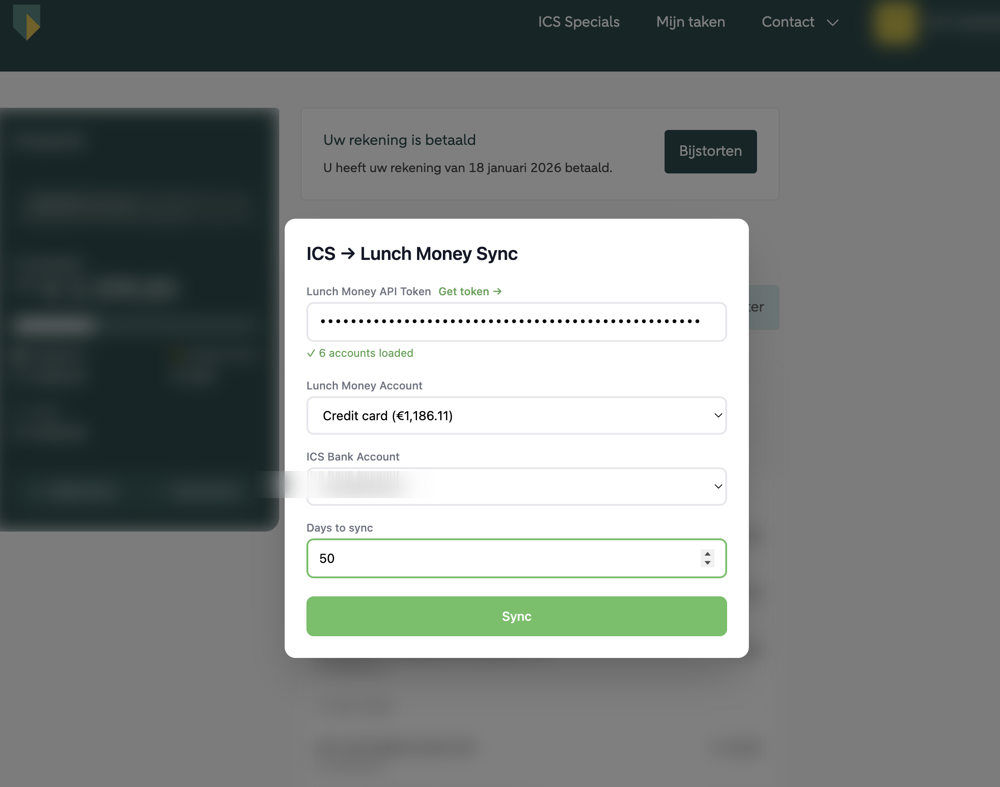
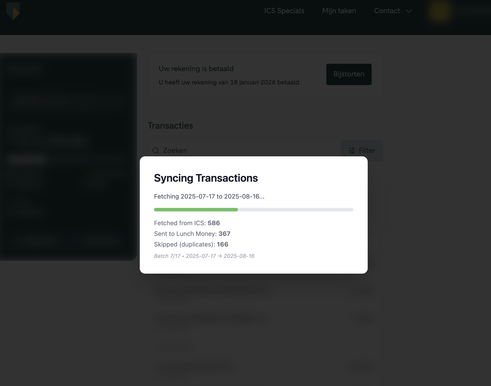
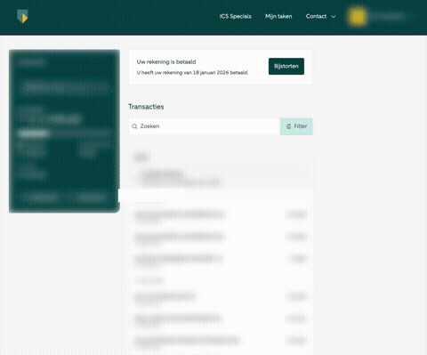

# ICS Lunch Money Sync - Bookmarklet

A browser bookmarklet that syncs ICS Bank (ABN AMRO) credit card transactions to [Lunch Money](https://lunchmoney.app) directly from your browser.

## Install

**[Click here to install the bookmarklet](https://getbookmarklets.com/scripts/add?source_url=https%3A%2F%2Fraw.githubusercontent.com%2FH1D%2Fics_lunchmoney_sync%2Fmain%2Fbookmarklet%2Fbookmarklet.js)** (drag the [Install bookmarklet] button there)

## Usage

1. Log into your ICS Cards account at [icscards.nl](https://www.icscards.nl)
2. Click the bookmarklet
3. Enter your Lunch Money API token, select accounts, choose how many days to sync
4. Hit **Sync**

| Setup | Sync progress |
|-------|---------------|
|  |  |

